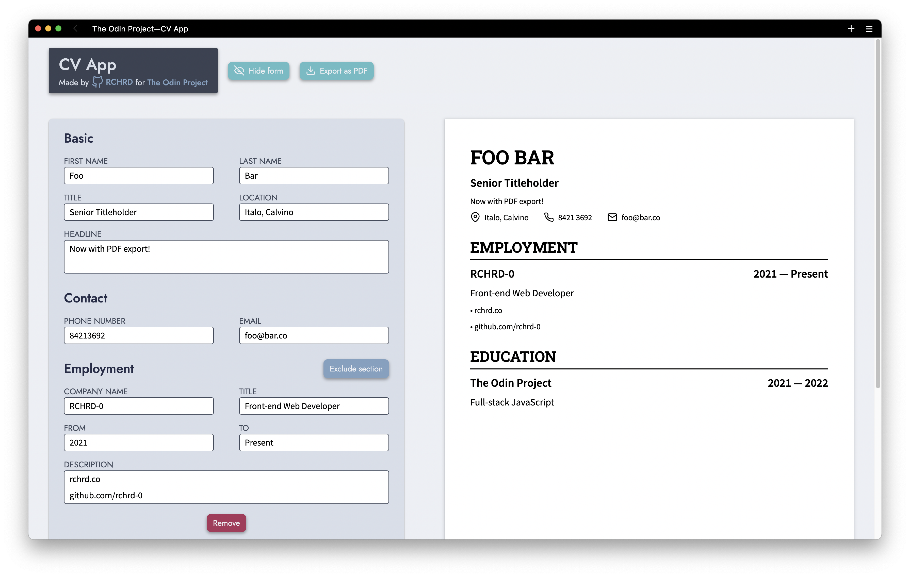

# cv-app

A HTML, CSS and JavaScript (React) project from The Odin Project's [curriculum](https://www.theodinproject.com/lessons/node-path-javascript-cv-application). Main focus:
* React fundamentals (components, states, props, create-react-app, conditional rendering), HTML, CSS

### Updates
* 26/07/22: First release
* 10/09/22
  * Preview can now be downloaded as a PDF with the help of [html2canvas](https://html2canvas.hertzen.com/) and [jsPDF](https://github.com/parallax/jsPDF)
  * Employment and education form sections can now be toggled
  * The same sections are now conditionally rendered on the preview so as to avoid orphan headings, hyphens and bulletpoints

Sources:
* Icons from [Feather](https://feathericons.com/) & [Glyphs.fyi](https://glyphs.fyi/)